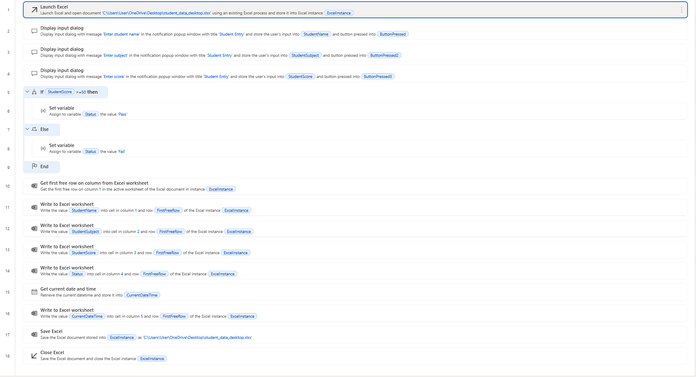
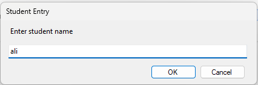
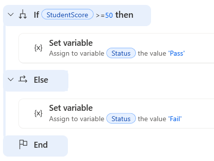
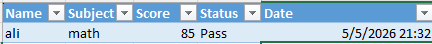

# Student Performance Automation System

## Overview
This project is a desktop automation workflow built using Microsoft Power Automate Desktop to automate student data entry and processing.

---

## Features

- User input for student name, subject, and score
- Automatic pass/fail evaluation
- Data stored in Excel
- Date and time logging

---

## Workflow Overview

---

## User Input

---

## Logic Implementation

---

## Output (Excel)

---

## Tools Used

- Microsoft Power Automate Desktop
- Microsoft Excel

---

## Skills Demonstrated

- Workflow automation
- Conditional logic
- Data handling
- Excel integration
